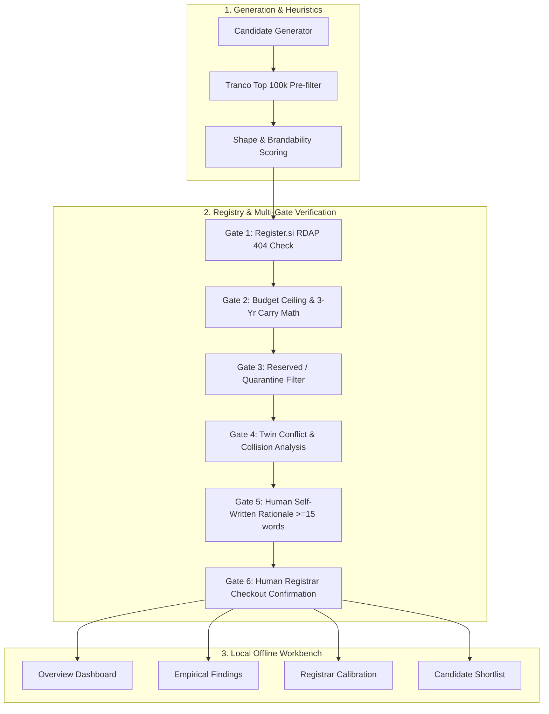

# SI Scout

SI Scout is an open-source, offline-first research workbench and heuristic screening engine for the `.si` (Slovenia) top-level domain namespace. Built for researchers, engineers, and defensive brand managers, it evaluates lexical patterns against authoritative RDAP registry data, enforces strict economic budget constraints (such as a $200 total 3-year loss ceiling), and mandates manual human rationale and registrar checkout verification before any domain can be shortlisted.

---

## What This Is / What It Is Not

| What This Is | What This Is NOT |
| :--- | :--- |
| **A Heuristic Filter**: Reduces thousands of raw lexical combinations down to a manageable shortlist based on length, brand collisions, and dictionary checks. | **Not an Appraisal Tool**: It does not forecast, calculate, or predict secondary market resale value or appreciation. |
| **An Offline-First Workbench**: Runs locally on `127.0.0.1` with zero remote telemetry, no external CDN dependencies, and synthetic demo fixtures. | **Not a Purchasing Bot**: It contains zero automated checkout bots, registrar cart automation, or payment integrations. |
| **A Multi-Gate Verification System**: Enforces 6 mandatory screening gates, including self-written human rationales and manual registrar checkout calibration. | **Not an Auto-Registrar**: All transactions must be executed manually by a human operator on official registrar websites. |
| **A Defensive Brand & Research Scanner**: Cross-references against the Tranco Top 100k to prevent trademark collisions and bad-faith registrations. | **Not Investment Advice**: Domain names are speculative and illiquid; domain-investing guides about curated .com portfolios (for example the Namecheap and Name.com guides) cite annual sell-through rates around 1–3% (not .si data), and expected value is negative. |

---

## Architecture

The system operates across three distinct layers: Lexical Generation, Gate Verification, and the Local Decision Workbench.



---

## Interactive Workbench Modules

1. **Reality Check (/)**: Displays live attrition metrics computed directly from build data files, establishing the baseline reality that most speculative portfolios lose money.
2. **Budget Lab (/budget)**: Interactive carry-cost and illiquidity arithmetic. Models holding costs over 1–5 years, prominently calculates the **probability of selling nothing** (e.g. 73.9% chance of zero sales with 5 names held 3 years at 2% sell-through), provides a color-blind-safe sensitivity heatmap, and exports to CSV or clipboard.
3. **Name Lab (/name-lab)**: Instant offline heuristic evaluator. Tests candidate labels for Register.si syntax rules, pronounceability, vowel ratio, and trademark blocklist collisions without network lookups.
4. **Funnel & Saturation (/funnel)**: Interactive visualization of candidate attrition (from 100 lexical ideas down to 4 strict survivors) with category-level saturation data.
5. **Gate Simulator (/gates)**: Interactive educational stepper demonstrating the six mandatory safety gates required before any capital can be committed.
6. **Story Mode (/story)**: Auto-playing 55-second slide sequence with aspect ratio controls (16:9, 1:1, 4:5), captions, and recording shortcuts for creators.

---

## 5-Minute Quickstart (Demo Mode)

Explore the workbench completely offline in under five minutes using synthetic fixtures with zero network calls.

### Windows
```cmd
# 1. Clone or navigate to the directory
cd "si domain project"

# 2. Run the one-click demo launcher
run_demo.bat
```

### macOS / Linux
```bash
# 1. Clone or navigate to the directory
cd "si-domain-project"

# 2. Make executable and run demo launcher
chmod +x run_demo.sh
./run_demo.sh
```

Open your browser to: **`http://127.0.0.1:8501`**

A persistent banner (`Demo data. Not real registry results.`) will confirm you are viewing synthetic fixtures without making outbound queries.

---

## Screenshots

| Findings & Attrition | Candidates Explorer | Registrar Calibration |
| :---: | :---: | :---: |
| <br><sub>*Empirical screening funnel & velocity*</sub> | <br><sub>*Screen 2: Multi-tier candidate filter*</sub> | <br><sub>*Registrar-vs-registry checkout verification*</sub> |

*(Place demo-mode screenshots in `docs/img/`)*

---

## The Six Screening Gates

SI Scout rejects the concept of automated "buy recommendations." A candidate only advances through explicit sequential hurdles:

1. **Gate 1: Authoritative RDAP Verification**: Domain must return an authoritative HTTP 404 (`not_found`) from `rdap.register.si`.
2. **Gate 2: 3-Year Carry Budget Compliance**: Year 1 registration plus 2 years of renewal fees must fit within the capital ceiling (default: USD 200 total capital with a 10% reserve).
3. **Gate 3: Reserved & Premium Exclusion**: Checks against Register.si restricted lists and known geographic/governmental reserved terms.
4. **Gate 4: Twin Collision Clearance**: Evaluates `.com` and `.ai` counterparts. Active commercial `.com` sites trigger caution to prevent trademark infringement.
5. **Gate 5: Human Rationale Gate**: Requires the operator to manually enter a minimum 15-word rationale in the format: *"A [type of organization] would use this because [functional purpose]."*. Auto-generated text is blocked.
6. **Gate 6: Registrar Checkout Confirmation**: An operator must manually search the domain at an accredited registrar checkout within 60 minutes, recording the exact registrar, UTC timestamp, and observed availability.

### Calibration Screen
To measure the gap between registry 404 responses and true registrar checkout availability (e.g. premium pricing, registry sync delays), the **Calibration Screen** tracks empirical agreement rates. If fewer than 10 manual comparisons exist, a warning is prominently displayed.

---

## Project Structure

```text
├── demo_data/               # Synthetic fixtures for offline demonstration
│   ├── results.csv          # Synthetic candidate evaluations
│   ├── scout.db             # SQLite cache & registry counter history
│   ├── calibration.json     # Synthetic registrar-vs-registry comparisons
│   └── findings_data.json   # Build-time data for Findings page
├── si_scout/                # Core screening engine
│   ├── rdap.py              # Register.si RDAP client (polite rate limits)
│   ├── score.py             # Heuristic scoring and gate validation
│   ├── twin.py              # Twin signal checker (.com / .ai)
│   └── registrars.yaml      # Pinned registrar pricing models (dated snapshots, not live data)
├── ui/                      # Local offline Flask workbench (127.0.0.1)
│   ├── app.py               # Application factory and route handlers
│   ├── data.py              # UIDataManager and findings calculator
│   └── templates/           # Clean, color-blind-safe templates
├── tests/                   # Automated pytest suite (unit, integration, demo)
├── scripts/                 # Bootstrap and data generation utilities
├── LIMITATIONS.md           # Reality audit and failure mode analysis
├── RESPONSIBLE_USE.md       # Anti-squatting, etiquette, and compliance
├── DISCLAIMER               # Legal disclaimers and affiliation notice
├── THIRD_PARTY_NOTICES.md   # Open-source licenses and attribution
└── LICENSE                  # MIT License
```

---

## Limitations & Risks

1. **ccTLD Policy & Verification**: Register.si prohibits anonymous WHOIS proxy services under regulations aligned with the NIS2 framework; registrant details must be verifiable.
2. **Illiquidity & Negative Expected Value**: Domain names have low liquidity. Holding costs accumulate annually. Domain-investing guides about curated `.com` portfolios (for example the Namecheap and Name.com guides) cite annual sell-through rates around 1–3%, while .si liquidity is unproven. Never commit capital exceeding a strict loss limit.
3. **Registry 404 != Ownership**: An RDAP 404 means an object is not active; it does not guarantee the domain will not be rejected during registrar checkout.
4. **Registrar Pricing Snapshots**: Prices listed in `si_scout/registrars.yaml` are dated snapshots for carry modeling, not live quotes. Actual checkout fees may vary.

For the complete technical critique, see [LIMITATIONS.md](LIMITATIONS.md).

---

## Pre-Publish Privacy Verification

Before publishing, running a fork, or pushing to any public repository, run the private terms scanner:
```bash
python scripts/check_private_terms.py
```
This utility ensures no unredacted operator terms or private research keywords are tracked in git.

---

## Credits & Attribution

- **Registry Data**: Query structures are designed to be polite to [Register.si](https://www.register.si/) public RDAP endpoints (ARNES); users should independently check the registry's terms.
- **Tranco List**: Brand collision pre-filtering references the Tranco Top Sites dataset ([Tranco Research](https://tranco-list.eu/), verify licensing at source site).
- **License**: Released under the [MIT License](LICENSE).


---

**Disclaimer:** Not affiliated with, or endorsed by, Register.si, ARNES, any registrar, Netcraft or Domain Name Wire. Product and company names belong to their owners. You are responsible for complying with the terms of any service you query.
